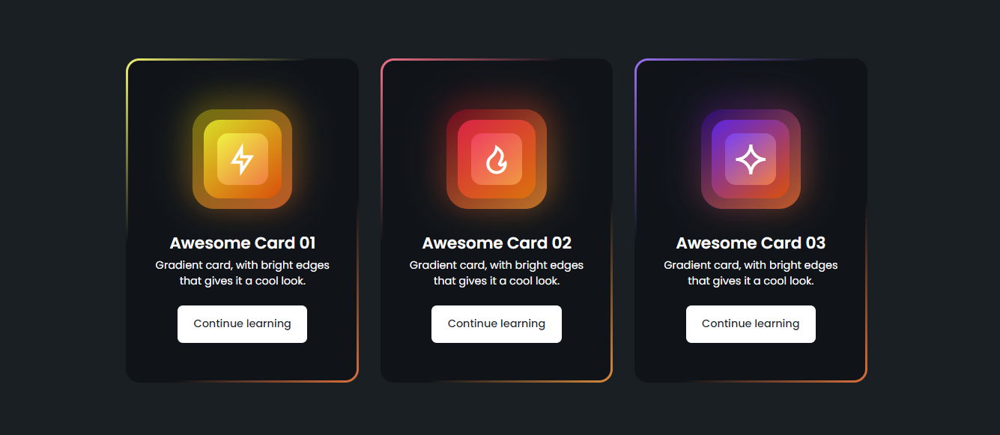

# Responsive Gradient Border Card #

* Responsive Gradient Border Card Using HTML & CSS .
* Contains glowing elements.
* With hover effect on hover.
* Developed first with the Mobile First methodology, then for desktop.

